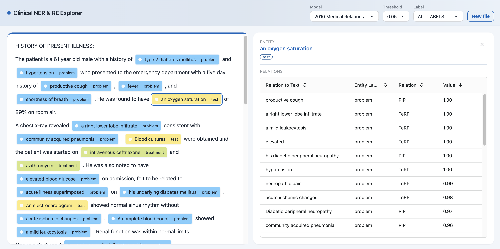

# Named Entity Recognition and Relation Extraction for Medical Records

## Description
This project originated as part of the KAP (Clinical Application Project) and has been significantly extended to form the core of a Bachelor's thesis.
The goal of the KAP was to create a lean and robust NLP pipeline that can accurately perform NER and subsequent analysis on various datasets, even in environments with limited computational resources.
The goal of the Bachelor's Thesis was to optimize existing NER approaches and augment them with a RE component.
To achieve this, the project leverages existing NLP and machine learning libraries, specifically spaCy and scikit-learn, to develop a custom pipeline. It further includes an Optuna script for hyperparameter optimization. This project includes a user interface (UI) to facilitate the use and demonstration of the developed models.
The i2b2 (Informatics for Integrating Biology & the Bedside) and n2c2 (National NLP Clinical Challenges) datasets from 2010, 2012, 2014, and 2018 were utilized for model training and evaluation.

## Getting Started
### Prerequisites
In order to run this project you need **Python** and **Node.js** installed on your local machine.
### Setup
Clone this repository to your desired folder.

### Installation
To install the dependencies listed in the ```requirements.txt``` file you can use a virtual environment.

First, create and activate a virtual environment to isolate your dependencies from the system-wide Python installation.

**On Windows**
~~~
python -m venv venv
venv\Scripts\activate
~~~

**On macOs/Linux**
~~~
python3 -m venv venv
source venv/bin/activate
~~~

Once your virtual environment is active, use ```pip``` to install the dependencies listed in the ```requirements.txt``` file:
~~~
pip install -r requirements.txt
~~~

## Models
The pipeline in this repo trains and evaluates NER and RE models for the i2b2 datasets, but **the trained model files themselves are not included in this repository**. They're trained on the i2b2 (2010/2012/2014) and n2c2 (2018) clinical datasets, which require their own signed Data Use Agreement, so the resulting model artifacts can't be redistributed alongside the code. To use the UI or run evaluations, you need your own copies of these datasets (under your own DUA) and need to train the models yourself using the `invoke` tasks described below.

### Filling in your own models
Once you've trained models of your own (see **Usage** below), point `tasks.py`'s `MODELS` and `TEST_DATA` dictionaries at them to use the year-shorthand commands (e.g. `invoke evaluate-ner 2012`), or just pass explicit paths to the `evaluate-ner`/`evaluate-re` tasks directly. `backend/app.py` also expects specific model paths (see its `MODELS_DIR`/model-loading code) to serve the UI.

## Usage
This project utilizes `invoke` for streamlined command execution, providing easy access to various workflows such as data preparation, model training, and evaluation. This allows you to perform complex operations with simple commands.

To view all available commands and their descriptions, run:
~~~
invoke --list
~~~
For detailed information on any specific command, use:
~~~
invoke --help <command_name>
# Example: invoke --help train-ner
~~~
Below are the examples of key commands:
- **split**: Divide raw i2b2 data (XML, ANN, CON) into train, dev, and test sets.
    ~~~
    invoke split --directory <path_to_data> --file-type <xml|ann|con> [--txt-directory <path_to_txt>] [--rel-directory <path_to_rel>]
    # Example for XML:
    invoke split ./path/to/data xml
    ~~~
- **create-json**: Transform split data into a JSON format suitable for spaCy.
    ~~~
    invoke create-json --data <path_to_input_data> --output <path_to_output.json> --year <2010|2012|2014|2018>
    # Example:
    invoke create-json ./files/train_data_raw ./files/train.json 2012
    ~~~
- **create-spacy**: Convert JSON data into spaCy's binary .spacy format for training.
    ~~~
    invoke create-spacy --json-file <path_to_input.json> --output <path_to_output.spacy> --data-type <ner|re>
    ~~~
- **train-ner**: Train a NER model
    ~~~
    invoke train-ner --output <output_model_path> --train <path_to_train.spacy> --dev <path_to_dev.spacy> [--config <path_to_config.cfg>]
    #Example:
    invoke train-ner ./ner_models/my_new_ner ./files/train_ner.spacy ./files/dev_ner.spacy --config ./path/to/config
    ~~~
- **train-re**: Train a RE model
    ~~~
    invoke train-re --output <output_model_path> --train <path_to_train.spacy> --dev <path_to_dev.spacy> --model <path_to_ner_model> [--config <path_to_config.cfg>]
    ~~~
- **ner**: Create .spacy data and train and evaluate a NER model
    ~~~
    invoke ner --train-json <path_to_train_json> --dev-json <path_to_dev_json> --test-json <path_to_test_json> --output <output_ner_model_path>
    ~~~
- **re**: Create .spacy data, train a NER model, then train and evaluate a RE model
    ~~~
    invoke re --train-json <path_to_train_json> --dev-json <path_to_dev_json> --test-json <path_to_test_json> --output <output_re_model_path>
    ~~~
- **evaluate-ner**: Evaluate a trained NER model
    ~~~
    # Year shorthand - only works once you've filled in MODELS/TEST_DATA in tasks.py:
    invoke evaluate-ner <dataset_year>
    # Example:
    invoke evaluate-ner 2012

    # Or evaluate a specific model with explicit paths (note: --test-data must be
    # passed as a flag, not a second bare argument):
    invoke evaluate-ner <path_to_model> --test-data <path_to_test.spacy>
    # Example:
    invoke evaluate-ner ./ner_models/ner_model_2012.3/model-best --test-data ./path/to/test_2012.spacy
    ~~~
- **evaluate-re**: Evaluate a trained RE model
    ~~~
    # Year shorthand - only works once you've filled in MODELS/TEST_DATA in tasks.py:
    invoke evaluate-re <dataset_year> [--use-gold-ne] [--print-details]
    # Example: Evaluate the default best RE model for 2018 with gold entities and detailed output:
    invoke evaluate-re 2018 --use-gold-ne --print-details

    # Or evaluate a specific model with explicit paths (again, flags rather than bare
    # positional arguments). --data-type controls dataset-specific scoring logic
    # (e.g. temporal closure for 2012) and should match the model's dataset year:
    invoke evaluate-re <path_to_model> --test-data <path_to_test.spacy> --data-type <year> [--use-gold-ne] [--print-details]
    # Example:
    invoke evaluate-re ./re_models/re_model_2012/model-best --test-data ./path/to/test_2012.spacy --data-type 2012
    ~~~

## Run UI
To start the UI, open your terminal inside the project and inside the **backend**
folder run:
~~~
python app.py
~~~
to start the backend (requires the trained models described in **Models** above to already be in place).
Then inside the **frontend** folder run:
~~~
npm install #if not already run
npm start
~~~
to start the frontend. The frontend runs on http://localhost:3000.
### UI Features
- **Uploading text files**: Users can upload PDF, TXT, or XML files. The text is extracted and sent to the backend for analysis using the selected model. The text with the marked entities is then displayed.
- **Model switching**: Users can choose between different NER models that have been specifically trained for various medical datasets (e.g., 2010, 2012, 2014, 2018). Selecting a new model triggers a re-analysis of the text, updating the results accordingly.
- **Filtering entities**: Users can filter the visualized entities by labels to specifically highlight certain entity types and enable a more focused analysis. With the extension of the models to include RE, the following additional features were added in this work:
- **Displaying relations**: By clicking on a marked entity, users can open a sidebar showing all relations originating from the clicked entity.
- **Threshold filter**: Users can filter the relations by threshold probability to specifically highlight certain probability values. The default probability value is 0.05.



## Project Structure
```bash
.
├── backend/                # Implementation of the backend
├── configs                 # Configs files for NER and RE
│   ├── ner_config.cfg
│   └── re_config.cfg
├── data_split                  # Train/dev/test filename splits uced per i2b2/n2c2 year (record IDs only, not raw clinical text)
│   ├── 2010
│   ├── 2012
│   ├── 2014
│   └── 2018
├── frontend/                   # Implementation of the frontend
├── ner_files                   # Scripts for NER data preparation and HPO
│   ├── generate_training_data.py   # Old script to create JSON files
│   ├── hp_tuning.py                # Code for HPO
│   └── json2spacy.py               # Converter for JSON to .spacy for NER
├── README.md
├── rel_files                   # Scripts for RE data preparation and HPO
│   ├── custom_functions.py
│   ├── json2spacy_re.py            # Converter for JSON to .spacy for RE
│   ├── rel_model.py                # Custom Thinc model
│   └── rel_pipe.py                 # Custom spaCy pipeline
├── requirements.txt
├── scripts                     # Utilities scripts
│   ├── generate_labels.py          # Helper functions for XML data extraction
│   ├── parse_2010_i2b2.py          # Converts i2b2 2010 data to JSON file
│   ├── parse_2012_i2b2.py          # Converts i2b2 2012 data to JSON file
│   ├── parse_2014_i2b2.py          # Converts i2b2 2014 data to JSON file
│   ├── parse_2018_i2b2.py          # Converts i2b2 2018 data to JSON file
│   ├── split_data.py               # Splits raw data into train, dev, test folders
│   └── utils.py
├── tasks.py                    # File for python invoke
└── testing                     # Evaluation and visualization tools
    ├── evaluate_ner_model.py       # Evaluate NER model
    ├── evaluate_re_model.py        # Evaluate RE model
    └── visualize_data.py           # Visualizes confusion matrix and classification report
```
